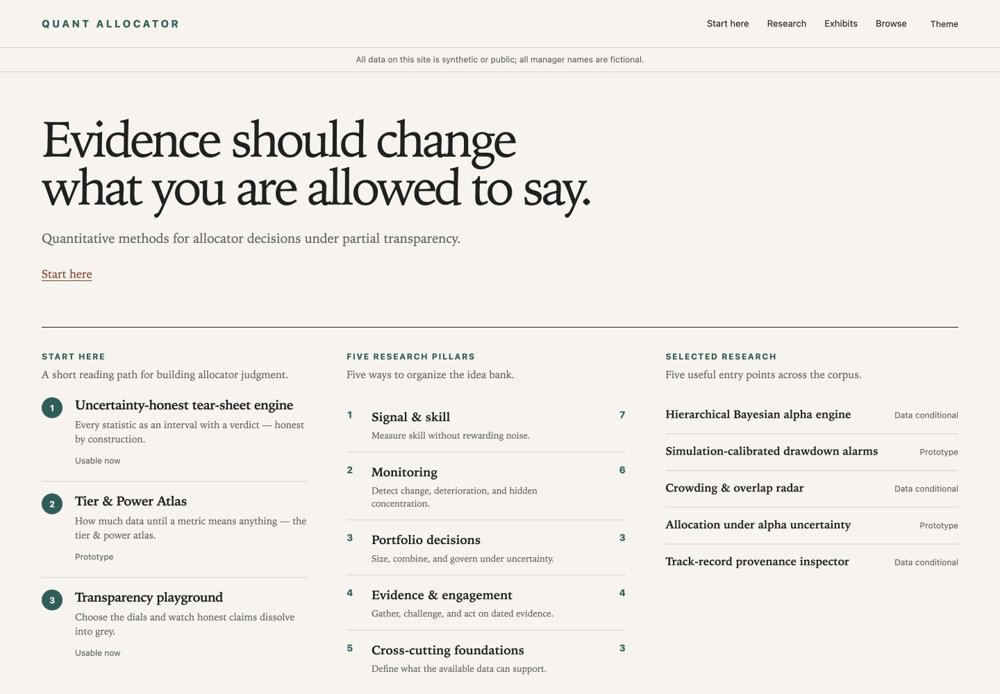
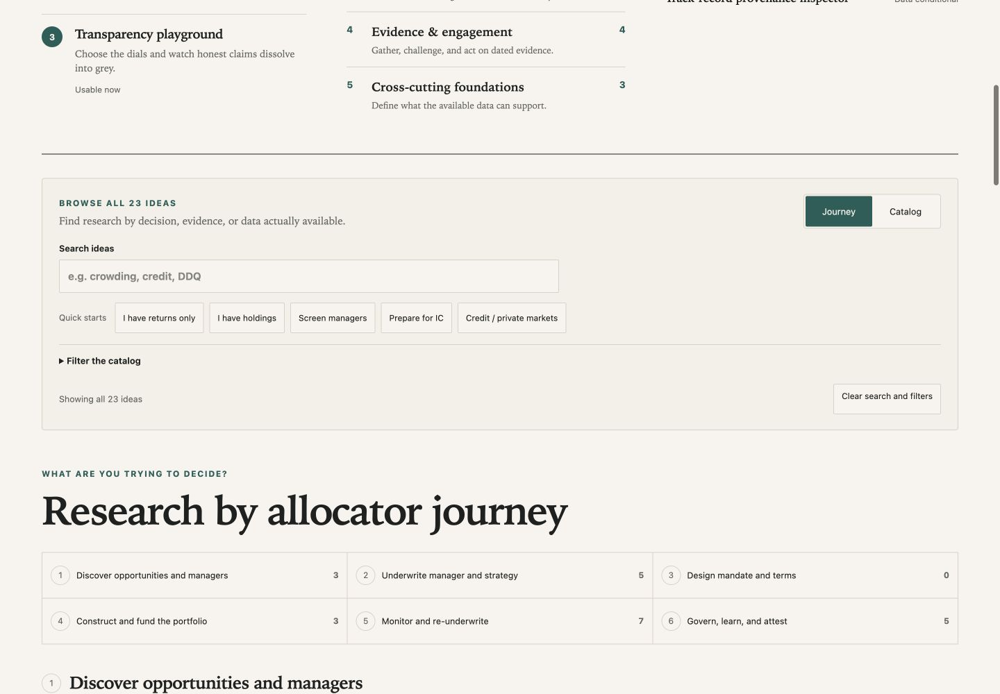
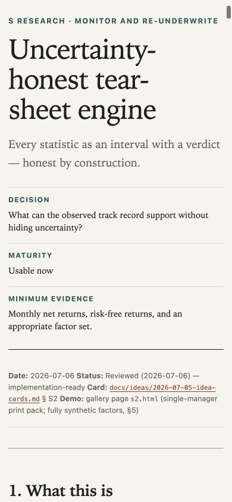
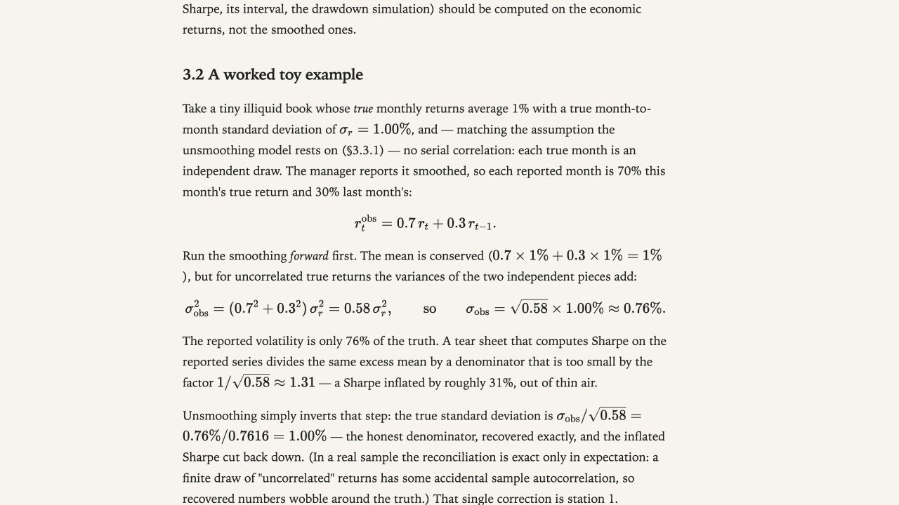
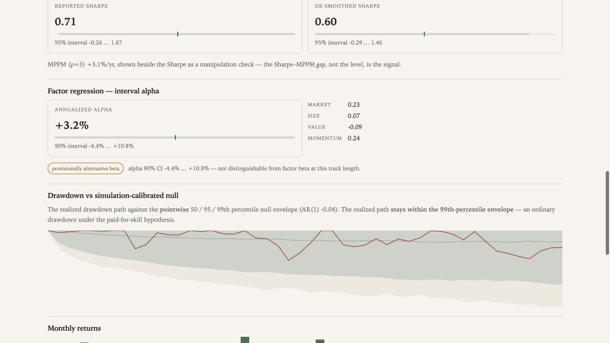
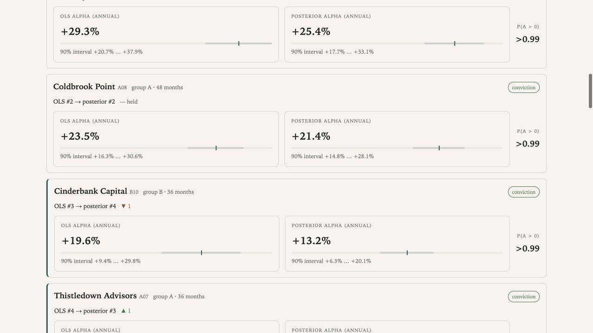
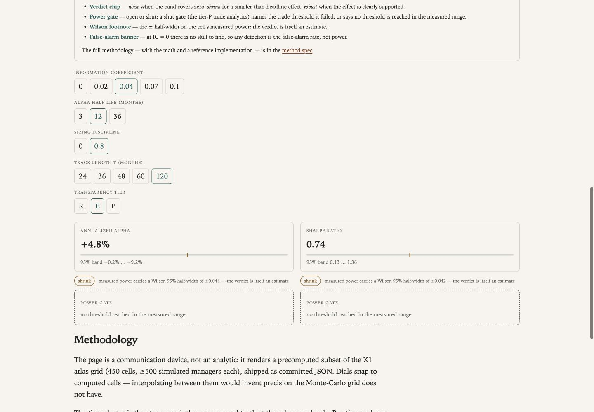
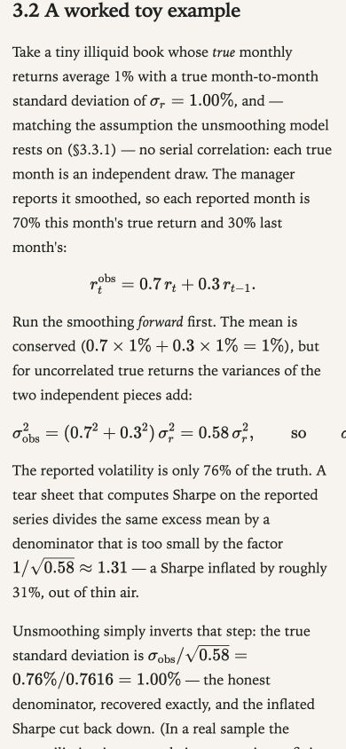

# Quant Allocator Reader-Journey Audit

**Date:** 2026-07-15

**Baseline:** public site and `main` at `795f22f`

**Live site:** <https://denim-bluu.github.io/quant-allocator/>

**Reference:** <https://aligrithm.com/>

**Result:** The site renders cleanly page by page, but the end-to-end reading journey is
confusing because internal research/governance structure is exposed as the public
editorial structure.

This audit is the evidence record for `docs/EDITORIAL_SYSTEM.md`. It is not a numerical
review and does not supersede method-spec arithmetic rulings.

## 1. Scope and method

The audit used the live rendered pages, not screenshots inferred from source code. It
covered desktop and 390px mobile states for:

- homepage, Start Here anchor, catalog/journey switching, presets, and filters;
- S2 and S1 articles;
- S2 and S1 exhibits;
- X2 article and interactive exhibit;
- the Aligrithm homepage, Start Here route, representative long-form articles,
  numerical examples, evidence figures, references, and mobile behavior.

Source inspection followed the visual audit to identify template and content-model
causes. Representative screenshots from Quant Allocator are committed with this record
because the original `/private/tmp` captures are reboot-fragile. Aligrithm observations
are preserved as text and URLs rather than copied site assets.

## 2. Executive finding

The visible problem is structural, not primarily cosmetic:

- The homepage asks the reader to choose among several navigation models before teaching
  how the corpus is organized.
- Public articles are complete internal method specifications rendered verbatim.
- Exhibits place a nine-field governance record before the main evidence.
- Strong examples and visuals exist, but appear late and without enough narrative
  anchoring.
- Article and exhibit pages lack a curriculum continuation model.
- Mobile stacking preserves the same problematic order and magnifies its cost.

The correction is to keep the reviewed numerical substrate and add a deliberately
reader-facing editorial layer.

## 3. Surface inventory

At the baseline, the generator emits:

| Surface | Count | Baseline behavior |
| --- | ---: | --- |
| Homepage | 1 | Thesis, Start Here, pillars, selected research, browser, journey index |
| Public articles | 23 | Full method Markdown rendered as the article body |
| Exhibits | 23 | Title and badges, decision/governance record, page-specific content |

The public articles range from approximately 774 to 9,497 words. S2 measured about
19,313 rendered pixels on desktop and 26,907 on mobile, with 87 rendered math elements,
two tables, one code block, and no inline figure or contents navigation.

## 4. Reader journey findings

### 4.1 Homepage: attractive opening, competing routes

The thesis and restrained visual system work. Immediately below, `Start here`, `Five
research pillars`, and `Selected research` receive similar visual weight. The evidence
browser and a separate `Research by allocator journey` index then add more organizational
models.

The browser's `Journey` / `Catalog` switch does not establish a clear semantic change.
After a preset switches to catalog state, the following section can still be titled
`Research by allocator journey`. An empty `Design mandate and terms` stage is also
rendered.

**Implication:** use pillars as the primary taxonomy and treat stage, evidence, maturity,
and scope as filters. Replace the Start Here link set with an actual curriculum page.

### 4.2 Start Here: a selection, not a sequence

The baseline Start Here items are S2, X1, and X2. They do not state a learning outcome,
reading time, difficulty, or why one follows another. X1 and X2 introduce tiers, power,
simulation grids, and several controls before a new reader has built the necessary
uncertainty and shrinkage mental models.

**Implication:** use S2 → S1 → M3 and frame each step as `trap → ability → next`.

### 4.3 Articles: strong substance without public editing

S2 opens with a useful decision/deck band, then exposes repository-facing Date, Status,
Card, source path, and Demo metadata before `What this is`. The same template behavior
appears on other articles, confirming a systemic source boundary problem.

Once reached, S2's unsmoothing example is concrete and effective: it gives numbers,
performs the calculation, and interprets why naive volatility and Sharpe are misleading.
This is the teaching pattern to preserve.

Long articles provide no contents list, reading position, key-takeaway ending, related
article, or previous/next curriculum step. Twenty-two cross-spec links lead to GitHub
source rather than the corresponding public article.

**Implication:** keep method specifications as technical authorities, but render an
explicit public article source with a separate technical-method link.

### 4.4 Exhibits: correct evidence appears too late

Every exhibit places the full decision context—stage, maturity, minimum data, asset and
vehicle scope, access semantics, validation, and attestation—before page-specific
teaching content.

For S2, the first metric began around 1,342px and the first chart around 1,915px on
desktop; on mobile the first chart began around 3,222px. The actual analytical panels are
clean, but the drawdown figure has no visible date/scale axes and limited direct
annotation. The return strip lacks visible time and units.

**Implication:** show the decision, focal result, and main visual first. Retain the full
governance record in a collapsed `Evidence and readiness` appendix.

### 4.5 S1: useful intervals become a roster wall

The S1 article has one of the corpus's strongest openings. Its exhibit then presents the
whole 20-manager roster with repeated OLS/posterior rails before establishing a focal
case. Shared scales and zero anchors are not visually prominent enough to support rapid
comparison.

**Implication:** narrate three focal managers, label shared anchors, then disclose the
full roster.

### 4.6 X2: the interaction works, but the lesson is understated

X2's precomputed controls update the display correctly. A tested state change moved the
alpha interval and verdict, but the change was expressed mainly through a thin rail,
border, and small chip. Five equally weighted dial groups obscure that transparency tier
is the main teaching variable. Inputs and outputs are separated vertically, forcing the
reader to remember the prior state.

**Implication:** instruct one comparison, keep active inputs and outputs together, and
state in one sentence why the verdict changed.

### 4.7 Continuation: artifact links exist, curriculum links do not

Articles link to exhibits near the top. Exhibits generally link back only at the bottom.
There is no distinction between `next in this learning path` and publication chronology,
and no true exhibit index.

**Implication:** provide paired links at both ends and explicit previous/next curriculum
navigation.

## 5. Mobile and accessibility findings

### Confirmed defect

At a 390px viewport, the S2 article's document measured 648px wide. A long display
equation was visibly clipped.

### Additional risks

- Several X2 dial targets are 31–38px rather than 44px.
- Selected states and interval rails depend on thin, low-contrast borders and color.
- Dense charts shrink rather than adopting a simpler mobile form.
- Small uppercase metadata and long context blocks create cognitive-navigation cost.
- The mobile menu target and overlay require keyboard/focus-order verification.

### Confirmed strengths

- Skip navigation and semantic regions are present.
- Headings are generally meaningful.
- Interactive state uses `aria-pressed` in the inspected controls.
- Body line length is comfortable on representative article pages.
- Synthetic/public-data disclosure is prominent.

Formal contrast measurement, screen-reader testing, zoom resilience, and reduced-motion
behavior were not completed in this audit.

## 6. What Aligrithm contributes

Aligrithm works best when it treats the publication as a curriculum rather than a feed:

- the homepage states a thesis, audience, and ordered set of pillars;
- Start Here explains why chronology is a poor learning route;
- pillars describe the belief a reader enters with and the ability they should gain;
- articles use an argumentative deck before technical detail;
- explanations move from intuition to formula to defined symbols to a small example;
- figures answer a named question and visibly mark the decisive threshold or comparison;
- limitations grade what the evidence does and does not establish;
- key points, references, and a next article close the loop.

Quant Allocator should adopt those editorial mechanics, not Aligrithm's visual skin.
The reference also has weaknesses: desktop density, large route tables, taxonomy drift,
subscription clutter, and mobile formula/chart overflow. Those should not be copied.

## 7. Source-level causes

The visual findings map to a small set of shared seams:

- `src/quant_allocator/site/build.py` renders each complete method spec as the public
  article and hard-codes homepage groupings.
- `site/templates/spec.html.j2` has no public/technical source boundary or curriculum
  scaffolding.
- `site/templates/demo.html.j2` places the governance record before page content.
- `site/templates/index.html.j2` composes several competing navigation systems.
- Twenty page-specific CSS files and standalone S7 styling make cross-page consistency
  incidental rather than contractual.

The existing Python/Jinja generator is sufficient. No CMS or platform rewrite is
needed.

## 8. Screenshot manifest

| File | Viewport | Page/state | Observation |
| --- | --- | --- | --- |
| `home-entry-desktop.jpg` | 1440×1000 | Homepage opening | Three equal entry systems after the thesis |
| `home-browse-desktop.jpg` | 1440×1000 | Homepage lower discovery | Browser and journey index compete semantically |
| `s2-article-metadata-mobile.jpg` | 390×844 | S2 article opening | Internal metadata delays the lesson |
| `s2-worked-example-desktop.jpg` | 1280×720 | S2 worked example | Strong numerical teaching pattern worth preserving |
| `s2-exhibit-analytics-desktop.jpg` | 1280×720 | S2 exhibit analytics | Evidence is useful but under-annotated and reached late |
| `s2-formula-overflow-mobile.jpg` | 390×844 | S2 long equation | Confirmed horizontal clipping and 648px document width |
| `s1-roster-density-desktop.jpg` | 1280×720 | S1 manager roster | Repetition precedes a focal teaching case |
| `x2-changed-state-desktop.jpg` | 1440×1000 | X2 at changed state | Correct state change lacks a clear narrative explanation |

## 9. Audit limits

This was a representative reader-journey audit, not an exhaustive certification of all
47 generated pages. It did not:

- re-derive statistical calculations;
- verify every article's factual claims or references;
- inspect every dark-theme state;
- perform formal assistive-technology or contrast testing;
- test every browser or viewport;
- inspect premium Aligrithm content.

These limits do not weaken the systemic finding because the core issues are produced by
shared article, exhibit, and homepage templates.

## 10. Required correction

Implement the reader-first contract in `docs/EDITORIAL_SYSTEM.md` as a narrow sequence:
S2 pilot, homepage/Start Here, shared-shell rollout, dense-page exceptions, and one final
rendered gate. Preserve numerical review unless a value, calculation, claim, or semantic
interpretation changes.
